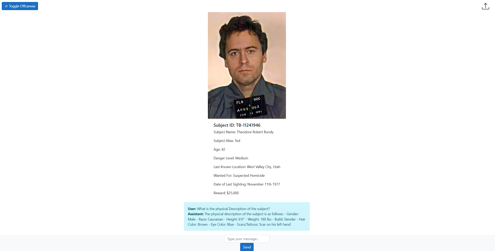
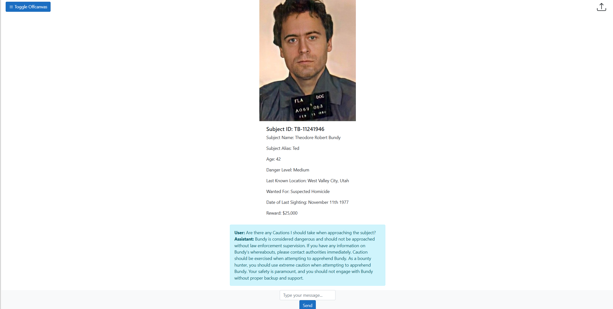
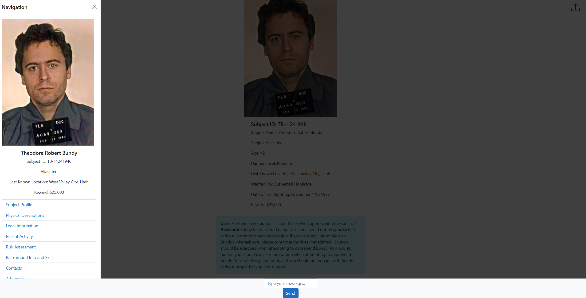

# BountyGPT

BountyGPT is a powerful application designed to streamline the process of apprehending bounties by leveraging advanced AI and cloud technologies. Built using .NET MVC, Azure OpenAI, and Azure Blob Storage, this project enables users to upload documents and interact with them through a chat interface, making it easier to gather and query relevant information about bounty subjects.

## Features

- **Document Upload**: Users can upload various documents related to their bounty subjects directly to Azure Blob Storage.
- **Chat Interface**: A user-friendly chat interface allows users to communicate with the uploaded documents, retrieving valuable information quickly and efficiently.
- **Azure OpenAI Integration**: Utilizes Azure OpenAI to process and understand the content of the uploaded documents, providing insightful and accurate responses.
- **Subject Portfolio**: Automatically builds a detailed portfolio of the bounty subject, compiling all the uploaded and analyzed data into an accessible format.
- **Query Functionality**: Enables users to query specific details about the bounty subject's bio and other pertinent information, aiding in the apprehension process.

## Getting Started

### Prerequisites

- .NET SDK
- Azure Account
- Azure Blob Storage
- Azure OpenAI Service

### Installation

1. Clone the repository:
    ```bash
    git clone https://github.com/yourusername/BountyGPT.git
    cd BountyGPT
    ```

2. Set up your Azure Blob Storage:
   - Create a storage account and a container to store the uploaded documents.
   - Note the connection string and container name for your Blob Storage.

3. Configure Azure OpenAI:
   - Set up an Azure OpenAI resource.
   - Obtain the API key and endpoint for your OpenAI service.

4. Configure your application:
   - Update the `appsettings.json` file with your Azure Blob Storage connection string and container name.
   - Add your Azure OpenAI API key and endpoint to the configuration.

5. Build and run the application:
    ```bash
    dotnet build
    dotnet run
    ```

### Usage

1. **Upload Documents**: Navigate to the document upload section and upload relevant documents related to your bounty subjects.
2. **Interact with Documents**: Use the chat interface to ask questions and retrieve information from the uploaded documents.
3. **View Subject Portfolio**: Access the automatically generated portfolio to get a comprehensive view of your bounty subject.




## Contributing

Contributions are welcome! Please submit a pull request or open an issue to discuss any changes or improvements.

## License

This project is licensed under the MIT License. See the [LICENSE](LICENSE) file for more details.

## Acknowledgements

- Thanks to OpenAI for providing the powerful AI models used in this project.
- Special thanks to the contributors and the open-source community for their support and contributions.

---

By using BountyGPT, you can make the process of apprehending bounties more efficient and informed by leveraging state-of-the-art AI technology and cloud solutions. Start using BountyGPT today and take advantage of the power of Azure OpenAI and Azure Blob Storage to streamline your bounty hunting process.
